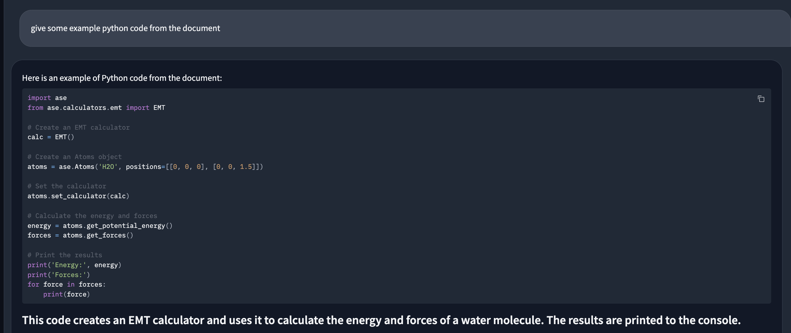

# 1.RAG (Retrieval Augmented Generation) on PDFs(present in data folder)



## Model Specification
**Model Used:** LLAMA3 8B  
**Hugging Face Models:** Any model from [Hugging Face](https://huggingface.co/models) can be used.

## Installation and Execution Steps

1. **Install Required Packages**  
   Run `pip install -r requirements.txt` to install the necessary dependencies.

2. **Execute the Script**  
   Use the command: python rag_llm.py --data_dir data/
- Defaults to using the LLAMA3 8B model.
- Defaults to retrieving data from the 'data' folder.
- You will be prompted to enter your Hugging Face API token in the terminal.

3. **Access the UI**  
Upon successful execution, a user interface will be available on port 7860 in the browser, allowing interaction with the LLM and the processed PDFs.


**Note:** 
- The model download may take some time during the first execution.

- Tried on Nvidia V100 32GB GPU  
- The 8B LLAMA model requires approximately 20GB of GPU memory.
- Update: For groq models use rag_llm_groq.py

Adapted from : https://www.fahdmirza.com/2024/02/tutorial-to-implement-rag-with-gemma.html

# 2.react_agent_with_query_engine:
Adapted from : https://docs.llamaindex.ai/en/stable/examples/agent/react_agent_with_query_engine/

## you'll need a groq account to run this example(however you can use any LLM you have access to) - https://groq.com/
- python react_agent.py --data_dir data/ --groq_api_key <your_key>

## In action: 
***************************************************************************************************

Query: Calculate bulk modulus of AL using EMT simulation

Thought: The current language of the user is: Python. I need to use a tool to help me answer the question.
Action: ASE1
Action Input: {'input': 'Calculate bulk modulus of AL using EMT simulation'}
INFO:httpx:HTTP Request: POST https://api.groq.com/openai/v1/chat/completions "HTTP/1.1 200 OK"
HTTP Request: POST https://api.groq.com/openai/v1/chat/completions "HTTP/1.1 200 OK"
Observation: The context information does not provide a direct method to calculate the bulk modulus of AL (aluminum) using EMT (Embedded Atom Method) simulation. However, it discusses QM/MM (Quantum Mechanics/Molecular Mechanics) simulations, which can be used to study the mechanical properties of materials.

To calculate the bulk modulus of AL, you would need to perform a simulation that involves deforming the material and measuring the resulting stress. This can be done using molecular dynamics or Monte Carlo simulations. The bulk modulus can then be calculated from the stress-strain relationship.

However, the provided context information does not provide the necessary details to perform such a simulation. You would need to consult additional resources or literature to determine the specific methods and parameters required for calculating the bulk modulus of AL using EMT simulation.
INFO:httpx:HTTP Request: POST https://api.groq.com/openai/v1/chat/completions "HTTP/1.1 200 OK"
HTTP Request: POST https://api.groq.com/openai/v1/chat/completions "HTTP/1.1 200 OK"
Thought: I need more information to provide a specific Python code for calculating the bulk modulus of AL using EMT simulation.
Action: ASE2
Action Input: {'input': 'Provide a Python code snippet for calculating bulk modulus of AL using molecular dynamics simulation in ASE'}
INFO:httpx:HTTP Request: POST https://api.groq.com/openai/v1/chat/completions "HTTP/1.1 200 OK"
HTTP Request: POST https://api.groq.com/openai/v1/chat/completions "HTTP/1.1 200 OK"
Observation: Here is a Python code snippet for calculating the bulk modulus of AL (aluminum) using molecular dynamics simulation in ASE:

```
from ase.calculators.lammpsrun import LAMMPS
from ase.optimize import BFGS
from ase.md.velocitydistribution import MaxwellBoltzmannDistribution
from ase.md.langevin import Langevin

# Define the AL atom
al_atom = Atoms('Al', positions=[(0, 0, 0)], cell=[10, 10, 10], pbc=True)

# Define the LAMMPS calculator
calc = LAMMPS(specorder=['Al'], files=['/path/to/potential/AlALCHEMY'])

# Set the calculator for the AL atom
al_atom.set_calculator(calc)

# Set the initial velocity distribution
MaxwellBoltzmannDistribution(al_atom, 300)

# Define the Langevin thermostat
dyn = Langevin(al_atom, 0.5, 300, 0.001)

# Run the molecular dynamics simulation
dyn.run(f=1000)

# Calculate the bulk modulus
bulk_modulus = al_atom.get_volume() * (al_atom.get_stress() / 3)
print('Bulk modulus:', bulk_modulus)
```

Note: You need to replace `'/path/to/potential/AlALCHEMY'` with the actual path to the LAMMPS potential file for AL.